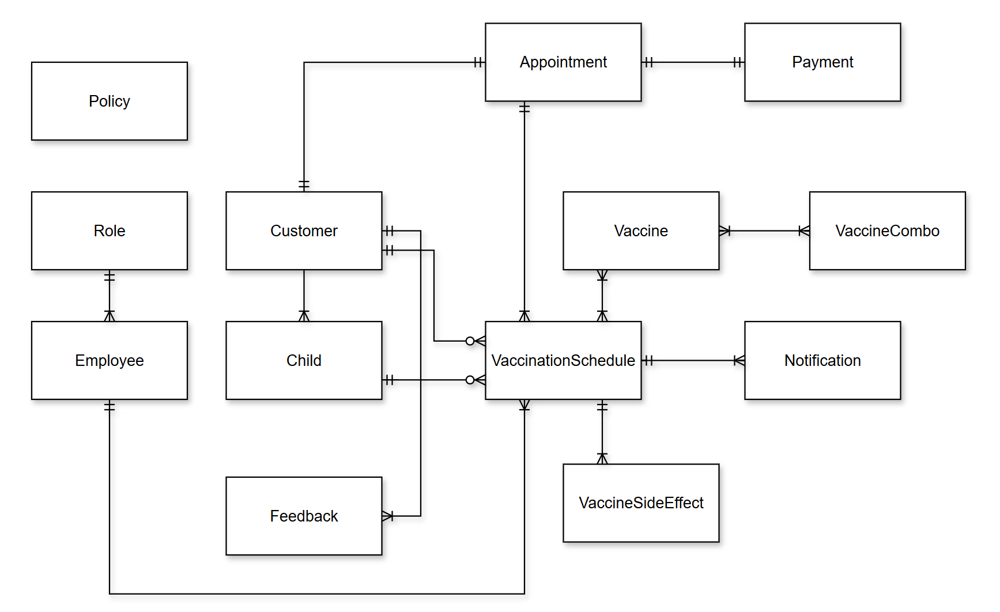
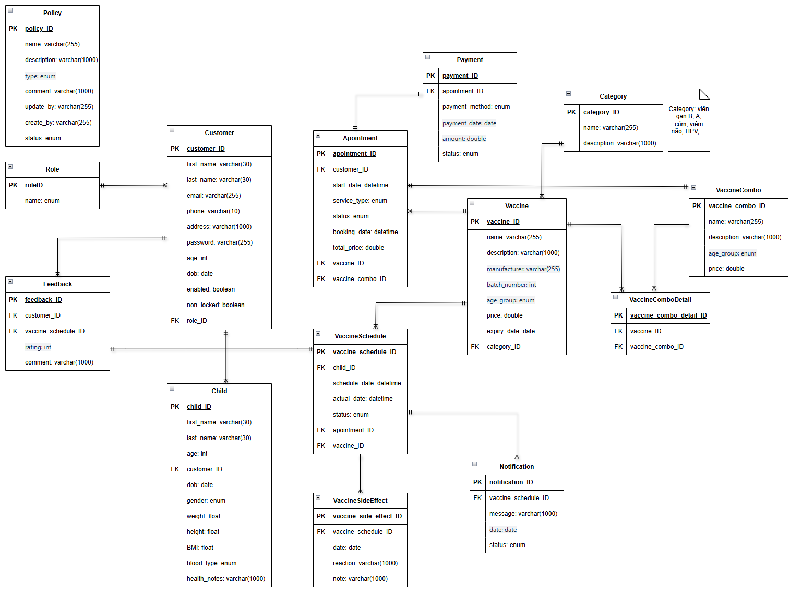

# 🌟 Child Vaccine Schedule Tracking System
**Phần mềm quản lý và theo dõi lịch tiêm chủng của trẻ em**

---

## 🧩 I - GIVEN

### 🏥 Phần mềm quản lý và theo dõi lịch tiêm chủng tại cơ sở

- 🌐 **Trang chủ:**
  - Giới thiệu thông tin cơ sở tiêm chủng
  - Dịch vụ tiêm chủng
  - Bảng giá
  - Cẩm nang tiêm chủng

- 📝 **Chức năng chính:**
  - Cập nhật thông tin hồ sơ trẻ em, quá trình tiêm chủng
  - Cung cấp lịch tiêm chủng và các mũi tiêm cần thiết theo độ tuổi
  - Đặt lịch tiêm (tiêm lẻ, trọn gói, cá thể hóa)
  - Gửi thông báo nhắc nhở mũi tiêm tiếp theo
  - Ghi nhận phản ứng sau tiêm (nếu có)
  - Quản lý thanh toán, hủy đơn đặt lịch
  - Báo cáo và thống kê

---  

## 🛠️ II - USER REQUIREMENTS

### 1️⃣ **Quản lý khách hàng**
- 👤 Thông tin khách hàng (Tên, Email, Số điện thoại, ...)
- 🧒 Hồ sơ trẻ em (Tên, Ngày sinh, Giới tính, ...)
- 📜 Lịch sử tiêm chủng từng trẻ
- ⭐ Feedback và đánh giá

### 2️⃣ **Quản lý vaccine**
- 💉 Danh sách vaccine (Tên, Nhà sản xuất, Hạn sử dụng, ...)
- 📊 Vaccine theo độ tuổi và combo tiêm gói
- 💲 Giá vaccine (lẻ, combo, cá thể hóa)

### 3️⃣ **Quản lý lịch tiêm chủng**
- 🗓️ **Lịch tiêm của nhân viên:**
  - Thông tin chi tiết lịch tiêm
  - Trạng thái (đã thực hiện, đã hủy, ...)
- 📅 **Lịch tiêm của khách hàng:**
  - Trạng thái đặt lịch (đã thanh toán, chưa thanh toán, ...)
  - Nhắc lịch tiêm

### 4️⃣ **Quản lý quá trình tiêm chủng**
- 🛡️ Quy trình: Đặt lịch → Đến cơ sở → Ghi nhận kết quả → Thanh toán → Đánh giá
- 🩺 Ghi nhận phản ứng sau tiêm
- 📆 Kế hoạch tiêm tiếp theo

### 5️⃣ **Quản lý chính sách đặt lịch, thanh toán, hủy đơn**
- 📋 Chính sách đặt lịch (thời gian, loại dịch vụ, ...)
- 💳 Chính sách thanh toán (Tiền mặt, Thẻ, Banking, ...)
- ❌ Chính sách hủy đơn (Thời gian, Chi phí phát sinh, ...)

### 6️⃣ **Quản lý rating và feedback**
- ⭐ Đánh giá của khách hàng
- 📈 Thống kê và báo cáo mức độ hài lòng
- 🔄 Phản hồi từ cơ sở tiêm chủng

### 7️⃣ **Quản lý dịch vụ tiêm chủng**
- 📌 Danh sách dịch vụ (Tiêm lẻ, Tiêm trọn gói, Cá thể hóa)
- 💹 Cập nhật bảng giá

### 8️⃣ **Dashboard và báo cáo**
- 📊 **Thống kê:**
  - Lịch tiêm theo ngày, tuần, tháng
  - Doanh thu theo dịch vụ
- 📝 **Báo cáo:**
  - Số lượng trẻ em tiêm chủng
  - Tỷ lệ hủy đơn

### 9️⃣ **Thông báo và nhắc nhở**
- ✉️ Nhắc lịch qua email
- 📆 Lịch tiêm tiếp theo dựa trên độ tuổi

### 🔟 **Quản lý nhân viên**
- 👨‍⚕️ Danh sách nhân viên (Tên, Vai trò, ...)
- 📋 Phân công lịch làm việc

---

## 👥 PRIMARY ACTORS

- 👤 **Guest**
- 👥 **Customer**
- 🩺 **Staff**
- 🛡️ **Admin**

---

## 🖼️ ENTITY RELATIONSHIP DIAGRAM

  

---

✨ **Tham khảo:**
- [VNVC](https://vnvc.vn/)
- [CDC Vaccines](https://www.cdc.gov/vaccines/)  

